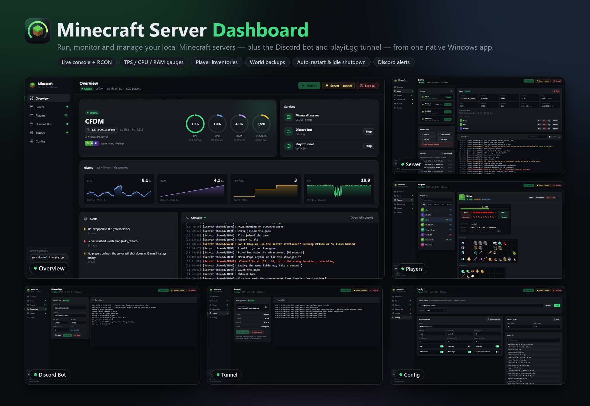
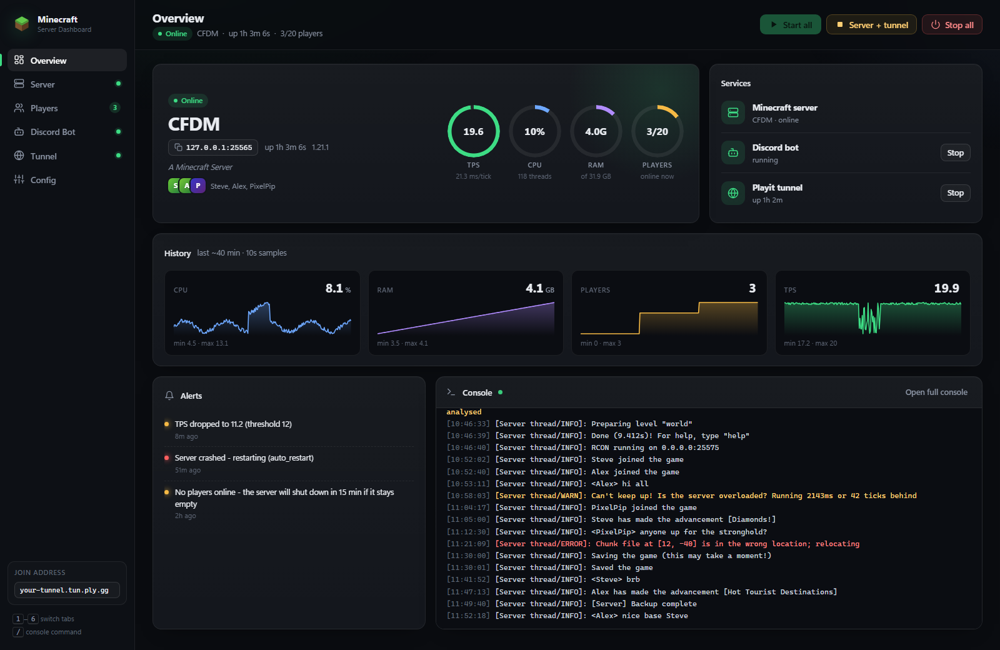
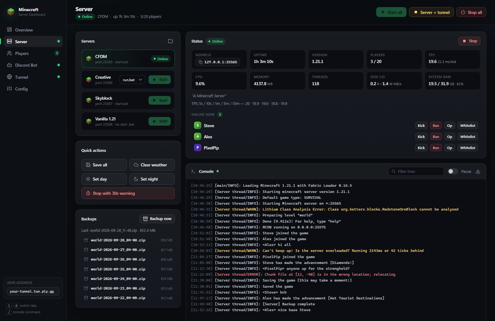
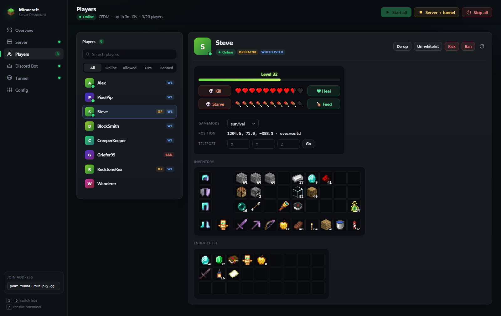
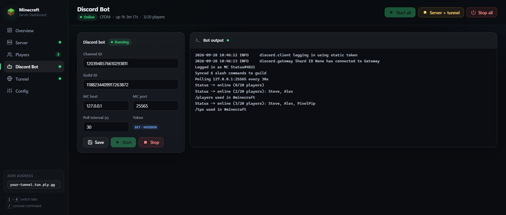
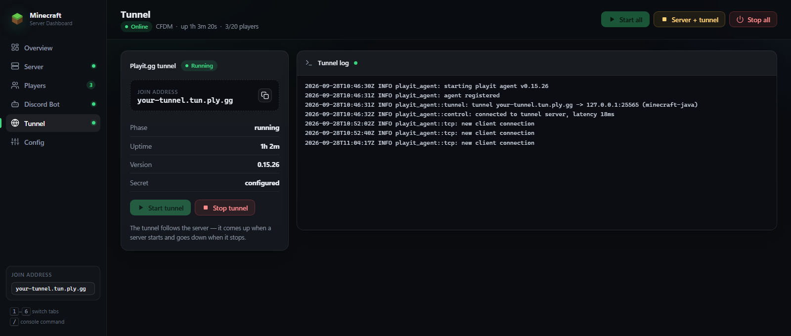
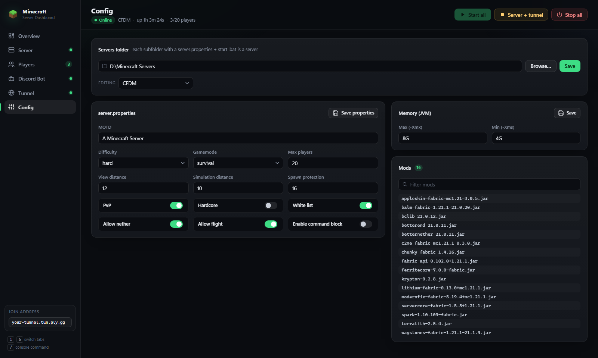

# Local Minecraft Server Dashboard



A native Windows desktop app to run and monitor your local Minecraft servers, plus the companion
[Discord bot](https://github.com/A2A1x/MinecraftServerDiscordBot) and a [playit.gg](https://playit.gg)
tunnel — all from one window. It's a Flask UI in a `pywebview` (Edge WebView2) window, packaged as a
single `.exe`.

**[Tour](#tour)** · **[Requirements](#requirements)** · **[Run](#run)** · **[Config](#config-configjson)** · **[Notes](#notes)**

## Tour

### Overview



Everything at a glance.

- **Server card** — state, name, join address (click to copy), uptime, version, MOTD and who's online.
  When the server is offline it turns into a **Start last server** button.
- **Gauges** for **TPS** (colour shifts green → amber → red as it drops), **CPU**, **RAM** (against
  system memory) and **players** (online / max).
- **Services** — the Discord bot and playit tunnel, each with a one-click Start / Stop.
- **History** — ~40 minutes of CPU, RAM, player count and TPS, sampled every 10 s, with min / max.
- **Alerts** — low TPS, low disk space, crashes and idle-shutdown warnings, with relative timestamps
  (optionally also posted to Discord).
- **Console** — the live server log, with a jump to the full console.

### Server



- **Servers** — every folder under your servers folder that has a `server.properties`, with its
  port and start script (pick one if there are several). Only one runs at a time; starting one
  stops any other.
- **Status** — address, uptime, version, players, TPS / MSPT (plus the 5 s → 15 m series from
  spark), CPU, memory, JVM threads, disk I/O and system RAM.
- **Online now** — kick, ban, op or whitelist anyone who's on.
- **Quick actions** — save-all, clear weather, day / night, and **stop with a 30 s warning** that
  counts players down in chat first.
- **Backups** — one-click world backup (save-off → zip → save-on, keeps the last N) and the list of
  existing zips.
- **Console** — level-coloured live log (streamed for servers the app started, tailed from
  `logs/latest.log` for ones it reconnected to), filter, pause, download `latest.log`, and a command
  box with ↑ / ↓ history. Reconnected servers take commands over **RCON**.
- **Stop** is always a clean `stop` (world save) before any force-kill.

### Players



- **Roster** of everyone the server knows (usercache, ops, whitelist, bans) with search and
  All / Online / Allowed / OPs / Banned filters. Online players sort to the top.
- **Player detail** — XP level, hearts and hunger drawn with the game's own sprites, gamemode,
  position and dimension, plus **kill / heal / feed / starve**, gamemode switch and **teleport**.
- **Inventory and ender chest** laid out like the in-game screen, with armour, offhand, stack
  counts, an enchantment shimmer and Minecraft-style hover tooltips (item name + enchantments).
  Modded item icons are pulled from the server's mod jars.
- **Op / whitelist / kick / ban** (and their undo) right from the header.
- Online players are read live over RCON; offline players come from their saved
  `playerdata/*.dat`, with the live-only actions greyed out.

### Discord Bot



Start / stop the [companion bot](https://github.com/A2A1x/MinecraftServerDiscordBot), edit its
`.env` settings (channel, guild, the server it polls, poll interval) and watch its output. Your
`DISCORD_TOKEN` is kept in the `.env` and never shown.

### Tunnel



The playit.gg join address with a copy button, the tunnel's phase / uptime / version, manual start /
stop and the agent log. The tunnel **follows the server**: it comes up when a server starts and goes
down when it stops.

### Config



- Pick the **servers folder** (native folder picker).
- Edit a server's **`server.properties`** — MOTD, difficulty, gamemode, player cap, view / simulation
  distance, spawn protection and toggles for PvP, hardcore, whitelist, the Nether, flight and
  command blocks.
- Set the JVM **memory** (`-Xmx` / `-Xms`) in its start script / `user_jvm_args.txt`.
- Browse and filter the installed **mods**.

### Around the app

- **Sidebar** with live status dots for the server, bot and tunnel, and an online-player count. It
  collapses to icons on narrow windows.
- **Top bar** with **Start all**, **Server + tunnel** (stop both, keep the bot) and **Stop all**.
  Destructive actions ask first; results and errors pop up as notifications.
- **Runs itself**: a scheduled daily restart, auto-restart on crash, and idle auto-shutdown when
  nobody's on. It can keep the PC awake while open (`keep_awake`).
- **Reconnects on reopen** — adopts a server or bot that's already running when you launch it again.
- **Keys:** <kbd>1</kbd>–<kbd>6</kbd> switch tabs and <kbd>/</kbd> jumps to the console command box.
  The last-open tab is remembered.

## Requirements

Windows (uses the built-in Edge WebView2 runtime), Python via the `py` launcher, and Java on
PATH for the servers. [playit.gg](https://playit.gg) is optional (tunnel controls); the
**spark** mod is optional (TPS). Some features need per-server settings in `server.properties`:
`enable-query=true` for the full player list, `enable-rcon=true` + `rcon.password` for commands
to adopted servers and TPS.

## Run

Build the app once (and again after pulling changes):

```bash
build.bat
```

This produces **`MinecraftDashboard.exe`** in the project folder — a single-file Windows app with
no console window. Double-click it, or right-click it → **Pin to Start** / **Pin to taskbar**. It
reads `config.json` / `state.json` from the folder it sits in, so keep them next to it if you move
it. Opening it while it's already running just opens another window onto the running instance.

To run from source instead (development), `run.bat` installs deps and opens the app window.
Flask is bound to `127.0.0.1` only (not network-reachable). To open in a browser instead (debugging):

```bash
py app.py --web
```

## Config (`config.json`)

Copy the template and edit it (`config.json` is gitignored — it holds your machine paths):

```bash
copy config.example.json config.json
```

| Key | Meaning |
| --- | --- |
| `servers_root` | Folder holding your server folders (each with a `server.properties` + start `.bat`) |
| `bot_dir` | The Discord bot repo (used to launch `bot.py` and edit its `.env`) |
| `playit_address` | Address players join (shown in the UI), if you use playit |
| `backup_keep` | How many world backups to retain |
| `restart_time` / `auto_restart` | Daily restart `HH:MM` (blank = off); relaunch on crash |
| `tps_alert` / `disk_alert_gb` / `discord_alerts` | Alert thresholds; also post alerts to Discord |
| `idle_shutdown_min` / `idle_grace_min` | Stop the server after N min with no players (0 = off); ignore the first `idle_grace_min` after startup |
| `keep_awake` | Keep the PC awake (prevents system sleep, not the display) while the dashboard is open so the server/tunnel stay reachable; sleeps normally once closed. Windows-only |
| `playit_exe` / `playit_log` | Paths to the playit CLI and its log (defaults are the standard install) |
| `host` / `port` | Where the dashboard listens |

## Notes

- The **playit tunnel follows the server**: it comes up when a server starts and goes down
  when the server stops (so the machine isn't tunnelling to a dead origin).
- Only one server runs at a time (they default to port 25565). Starting one stops any other.
- Bot settings are written to the bot's `.env`; your `DISCORD_TOKEN` is preserved and never shown.
- Editing a **running** server's `server.properties` only takes effect on restart and may be
  overwritten when it stops — edit while stopped.
- The player-panel heart / hunger icons in `static/mc/` and the item / block icons in
  `static/items/` are Minecraft textures © Mojang / Microsoft, included for the player detail
  view. The 3D block icons in `static/items/render/` are rendered from vanilla block models the
  way the game does (isometric pose + face shading + tint); regenerate them for another version
  with `py tools/render_icons.py <client.jar> static/items/render` (needs `Pillow` + `numpy`).
  Modded item icons aren't shipped — they're pulled on demand from the selected server's mod jars.

## Test

```bash
py test_app.py
```
