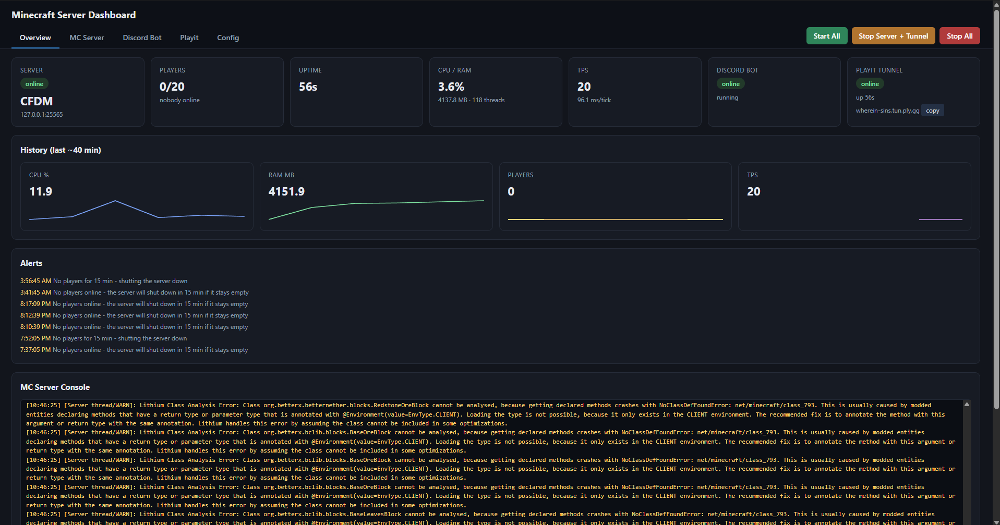

# Local Minecraft Server Dashboard

A native Windows desktop app (Flask UI in a `pywebview` window) to run and monitor your local
Minecraft servers, plus the companion [Discord bot](https://github.com/A2A1x/MinecraftServerDiscordBot) and a
[playit.gg](https://playit.gg) tunnel — all from one screen.



Features:

- **Launch/stop** any server folder (one at a time), with a clean `stop` (world-save) before
  any force-kill, and a **"stop with countdown"** that warns players first.
- **Reconnect on reopen** — adopts a server/bot already running when you relaunch the app.
- **Live console** (streamed for servers it started, tailed from `logs/latest.log` for adopted
  ones) with level-coloured lines, filter, and command box. Adopted servers accept commands via
  **RCON**.
- **Player admin** — kick / ban / op / whitelist buttons; **quick actions** (save-all, weather,
  time, …).
- **Metrics** — CPU, RAM, threads, disk I/O, plus **TPS/MSPT** (via the spark mod over RCON) and
  **history sparklines**.
- **World backups** (save-off → zip → save-on, keep last N) and a per-server **config editor**
  (`server.properties`, JVM `-Xmx/-Xms`, mod list).
- **Alerts** for low TPS / low disk / crashes, shown in the UI and optionally posted to Discord.
- **Scheduled daily restart** and **auto-restart on crash**.
- **playit** and **Discord bot** start/stop and console/settings.

## Requirements

Windows (uses the built-in Edge WebView2 runtime), Python via the `py` launcher, and Java on
PATH for the servers. [playit.gg](https://playit.gg) is optional (tunnel controls); the
**spark** mod is optional (TPS). Some features need per-server settings in `server.properties`:
`enable-query=true` for the full player list, `enable-rcon=true` + `rcon.password` for commands
to adopted servers and TPS.

## Run

Double-click the **Minecraft Dashboard** desktop shortcut (no console window), or:

```bash
run.bat
```

`run.bat` installs deps and opens the app window. Flask is bound to `127.0.0.1` only (not
network-reachable). To open in a browser instead (debugging):

```bash
py app.py --web
```

## Config (`config.json`)

Copy the template and edit it (`config.json` is gitignored — it holds your machine paths):

```bash
copy config.example.json config.json
```

| Key | Meaning |
| --- | --- |
| `servers_root` | Folder holding your server folders (each with a `server.properties` + start `.bat`) |
| `bot_dir` | The Discord bot repo (used to launch `bot.py` and edit its `.env`) |
| `playit_address` | Address players join (shown in the UI), if you use playit |
| `backup_keep` | How many world backups to retain |
| `restart_time` / `auto_restart` | Daily restart `HH:MM` (blank = off); relaunch on crash |
| `tps_alert` / `disk_alert_gb` / `discord_alerts` | Alert thresholds; also post alerts to Discord |
| `idle_shutdown_min` / `idle_grace_min` | Stop the server after N min with no players (0 = off); ignore the first `idle_grace_min` after startup |
| `playit_exe` / `playit_log` | Paths to the playit CLI and its log (defaults are the standard install) |
| `host` / `port` | Where the dashboard listens |

## Tabs

**Overview** (status tiles, history graphs, alerts, console) · **MC Server** (start/stop,
console, commands, players, quick actions, backups) · **Discord Bot** (start/stop + `.env`
settings) · **Playit** (tunnel control + log) · **Config** (per-server `server.properties`,
memory, mods).

## Notes

- The **playit tunnel follows the server**: it comes up when a server starts and goes down
  when the server stops (so the machine isn't tunnelling to a dead origin).
- Only one server runs at a time (they default to port 25565). Starting one stops any other.
- Bot settings are written to the bot's `.env`; your `DISCORD_TOKEN` is preserved and never shown.
- Editing a **running** server's `server.properties` only takes effect on restart and may be
  overwritten when it stops — edit while stopped.

## Test

```bash
py test_app.py
```
